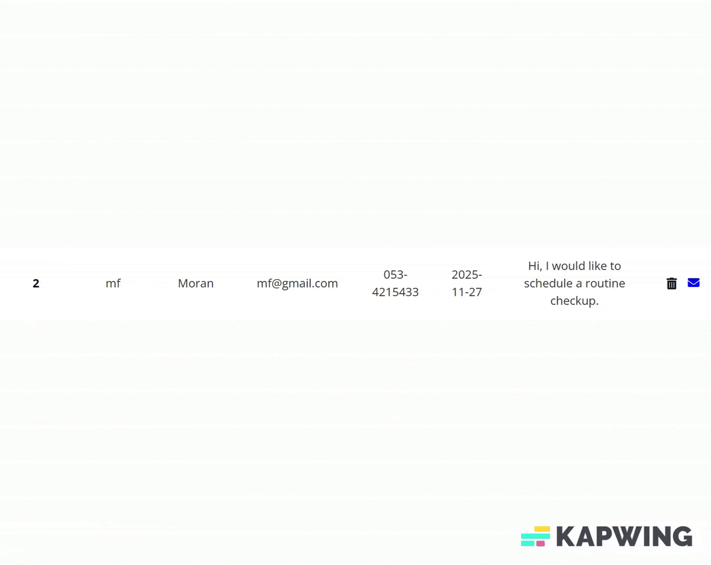

<div align="center">

# 🩺 Medic Care – Medical Visit Management System

**A full-stack dashboard for managing doctors, appointments, users, and reminders.**  
Built with **Flask**, **SQLAlchemy Core**, and **Bootstrap**.

<div align="center">
  <a href="https://medic-care-50f9.onrender.com/" target="_blank">
    
  </a>
  &nbsp;
  <a href="https://medic-care-50f9.onrender.com/admin" target="_blank">
    
  </a>
</div>


**Admin Login**

| User Name       | Password                         |
|-------------|-------------------------------------|
| admin|123456|

> ⏳ *First load might be slow (Render cold start)*

---

### 🚀 Tech Stack
<div align="center">


</div>

</div>

---

## 📚 Table of Contents

- [📌 Overview](#-overview)
- [🧰 Tech Stack](#-tech-stack)
- [🎥 Screenshots & GIFs](#-screenshots--gifs)
- [📁 Project Structure](#-project-structure)
- [📁 How it Works](#-How--it--Works)
- [🧠 Features Breakdown](#-features-breakdown)
- [🧱 Validation & Error Handling](#-validation--error-handling)
- [🔐 Permissions](#-permissions)
- [🧪 Testing](#-testing)
- [⚙️ Installation](#-installation)
- [💻 Code Examples](#-code-examples)
- [🚀 Planned Enhancements](#-planned-enhancements)
- [📄 License](#-license)

---

## 📌 Overview

**Medic Care** is a responsive, full-stack admin panel designed for clinics and medical teams to manage appointments, staff, and users.

### 🧩 Key Features
-  Admin login with password hashing
-  Doctor management (CRUD + image upload)
-  Appointment scheduling with email reminders
-  User management (block/unblock, validation)
-  Responsive UI (Bootstrap 5)

---

## 🧰 Tech Stack

| Layer       | Technology                         |
|-------------|-------------------------------------|
| Backend     | Flask (Python 3.10+)               |
| Database    | SQLAlchemy Core + SQLite           |
| Frontend    | HTML, CSS, JavaScript, Bootstrap   |
| Templates   | Jinja2                             |
| Auth        | Flask-Login + Werkzeug             |
| Hosting     | Render.com                         |

---

## 📁 Project Structure


medic-care/<br>
│ <br>
├── app/               # Main Flask app <br>
│   ├── static/        # CSS, JS, images, fonts, GIFs <br>
│   ├── templates/     # Jinja2 templates <br>
│   └── server.py      # Entry point <br>
├── models/            # SQLAlchemy Core definitions  <br>
├── README.md <br>
├── requirements.txt <br>
└── Python_db.sql         # Optional SQL Server schema <br>

## 💡 How it Works 

1. **Client** visits the main page and books an appointment via a simple form.
2. **Appointment data** is stored in the database and becomes visible in the admin dashboard.
3. **Admin** can view, delete, or send email reminders to patients.

| Patient booking an appointment (Client view) | Admin sending email reminder |
|------------------------|--------------------------|
|  |  |


---

## 🧠 Features Breakdown

###  Doctor Management
- Add/edit/remove doctors
- Upload image, define specialization, age, seniority

### Appointment System
- Add/view/delete appointments
- Includes email + datetime
- Built-in "mailto" for reminders

###  User Management
- Register, validate, block/unblock
- Input validation + error handling

###  Admin Security
- Single admin user (hashed password)
- Generic login error messaging
- Basic XSS/SQLi input sanitation

---

## 🧱 Validation & Error Handling

| Area          | Validations                                        |
|---------------|----------------------------------------------------|
| Login         | Required fields, bad credentials, invalid user     |
| Registration  | Email format, duplicates, password rules           |
| Doctor CRUD   | All fields required                                |
| Appointments  | Valid email/date/time, no blanks                   |
| Global Errors | Fallback error pages for HTTP 500+ errors          |

---

## 🔐 Permissions

| Role   | Access                                                   |
|--------|----------------------------------------------------------|
| Admin  | Full control over users, doctors, and appointments       |
| Users  | Can book appointments and receive email notifications    |

---

##  Testing

✅ Manual testing done for:
- Login (valid & invalid)
- Doctor CRUD
- Appointment creation/deletion
- User registration/blocking

❌ Automated tests not yet implemented (planned)

---

## ⚙️ Installation

```bash
git clone https://github.com/YOUR_USERNAME/medic-care.git
cd medic-care

# Create virtual environment
python -m venv venv
source venv/bin/activate  # On Windows: venv\Scripts\activate

# Install dependencies
pip install -r requirements.txt

# Run the app
python app/server.py

```
## 📷 Screenshots & GIFs
Login
 <br>
<p align="center">  </p>
 <br>

### Doctor CRUD

| admin editing a doctor | admin deleting a doctor |
|------------------------|--------------------------|
|  |  |


## 📥 Example: Add Doctor
```
def add_doctor(name, seniority, age, category, image_url, description):
    values = {
        "dr_name": name.strip(),
        "dr_seniority": int(seniority),
        "dr_age": int(age),
        "dr_category": category.strip(),
        "dr_image_url": store_data_uri(image_url),
        "dr_description": description.strip(),
    }
    session.execute(insert(doctors).values(**values))
    session.commit()
 ```
 📄 Source: [`/app/models/doctor.py`](./app/models/doctor.py)

Password Hashing
```
from werkzeug.security import generate_password_hash

hashed = generate_password_hash(password, method='pbkdf2:sha256', salt_length=16)
```
📄 Source: [`/app/models/user.py`](./app/models/user.py)

## 🚀 Planned Enhancements

 - PWA support for mobile use

 - Analytics dashboard for appointments

 - Search and filter for appointments

 - Multi-language support

 - WebSocket alerts

## 🧾 License

MIT License
© 2025 Your Name or Organization

## 🎓 Development Context

This project was originally created as a final assignment for a Python backend course. The primary goal was to implement backend fundamentals such as authentication, CRUD operations, and clean separation of concerns using Flask and SQLAlchemy Core.

If further developed beyond the course scope, I would prioritize the following real-world improvements:

- Preventing overlapping appointments – to avoid scheduling conflicts for the same doctor
- Validating past-date entries – ensuring appointments can't be scheduled in the past
- Medical history tracking – allowing the system to store and present each patient's journey
- Post-visit summaries – enabling doctors to document visit outcomes and follow-ups
- Patient access to visit summaries – allowing clients to view the summary of their latest appointments
- Separate internal dashboard for staff – providing a streamlined interface for medical and administrative personnel


---

Feedback, issues, and pull requests are welcome!
